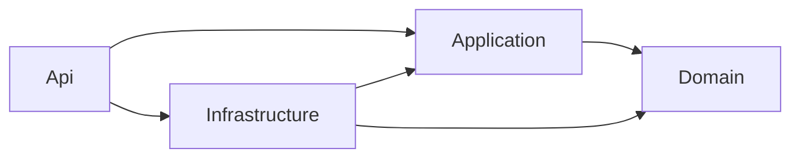

# IsoDocs 架構說明

> 對應 issue #1：建立 ASP.NET Core 8 後端專案骨架與 CQRS 架構

## 1. 設計原則

- **CQRS**：以 MediatR 將「會改變狀態的命令（Command）」與「只讀取的查詢（Query）」分離，避免長期累積的服務類別變成肥大的「上帝物件」。
- **分層（Clean Architecture）**：依賴關係單向往內，內層（Domain）不認識外層（Infrastructure / Api），方便測試與抽換實作。
- **管線行為（Pipeline Behavior）**：橫切關注點（驗證、日誌、未來的稽核、交易）由 MediatR Behavior 統一處理，不污染各個 Handler。
- **失敗外顯**：以 RFC 7807 ProblemDetails 統一錯誤回應，並區分 400 / 401 / 422 / 500 等語義。

## 2. 解決方案結構

```
IsoDocs.sln
├── src/
│   ├── IsoDocs.Api/             ← Web API 入口層
│   ├── IsoDocs.Application/     ← 應用服務層（CQRS Handler、Pipeline）
│   ├── IsoDocs.Domain/          ← 領域層（Entity、Value Object、領域例外）
│   └── IsoDocs.Infrastructure/  ← 基礎設施層（DB、外部服務整合）
└── tests/
    └── IsoDocs.Application.UnitTests/
```

## 3. 依賴方向



> 重點：Domain 不依賴任何上層；Application 只依賴 Domain；Infrastructure 實作 Application 定義的介面；Api 是組合根，負責 DI 註冊與 HTTP 對外。

## 4. CQRS 與 MediatR

### 4.1 命令（Command）

```csharp
public sealed record CreateCaseCommand(string Title, Guid TemplateId)
    : ICommand<Guid>;  // 回傳新 CaseId

public sealed class CreateCaseHandler : ICommandHandler<CreateCaseCommand, Guid>
{
    public Task<Guid> Handle(CreateCaseCommand request, CancellationToken ct)
    {
        // 1. 驗證業務規則
        // 2. 透過 Repository 寫入
        // 3. 發布 Domain Event
        // 4. 回傳新 ID
        return Task.FromResult(Guid.NewGuid());
    }
}
```

### 4.2 查詢（Query）

```csharp
public sealed record GetCaseByIdQuery(Guid CaseId) : IQuery<CaseDto>;

public sealed class GetCaseByIdHandler : IQueryHandler<GetCaseByIdQuery, CaseDto>
{
    public Task<CaseDto> Handle(GetCaseByIdQuery request, CancellationToken ct) =>
        // 直接讀資料庫或讀模型，避免重新組裝聚合
        throw new NotImplementedException();
}
```

> 命名規約：`{Verb}{Subject}Command` / `{Verb}{Subject}Query`，Handler 同名加上 `Handler` 後綴。

## 5. Pipeline Behavior

註冊順序（外 → 內）：

```
Request → LoggingBehavior → ValidationBehavior → Handler → Response
```

### 5.1 ValidationBehavior

掃描所有 `IValidator<TRequest>`，驗證失敗會聚合成單一 `FluentValidation.ValidationException`，由全域例外中介軟體轉換為 400 ProblemDetails，並把欄位錯誤放在 `errors` 字典裡。

### 5.2 LoggingBehavior

進出 Handler 各記錄一次 Information 級別日誌，方便追蹤請求流。

> 後續可加入：
> - **TransactionBehavior**：將 Command 包進 EF Core 交易（issue #5 之後）。
> - **CachingBehavior**：將特定 Query 結果快取（如有效能議題時）。
> - **AuditBehavior**：將 Command 結果寫入 AuditTrail（issue #5 之後）。

## 6. 全域例外處理

`GlobalExceptionMiddleware` 攔截所有未處理例外，依型別轉換：

| 例外類型 | HTTP Status | 用途 |
| --- | --- | --- |
| `ValidationException` | 400 | FluentValidation 驗證失敗 |
| `DomainException` | 422 | 業務規則違反（含 `code` 擴充欄位） |
| `UnauthorizedAccessException` | 401 | 認證/授權失敗 |
| 其他 | 500 | 未知錯誤；非 Development 隱藏 stack trace |

回應主體統一為 `application/problem+json`（RFC 7807），並在 `traceId` 擴充欄位帶上請求識別碼，方便比對日誌。

## 7. 命名與風格

- C# 12 / .NET 8、`Nullable` 開啟、`ImplicitUsings` 開啟。
- 檔案／類別／方法以英文命名；註解可使用繁體中文。
- 資料夾分層比命名更重要：`Features/{FeatureName}/{Commands|Queries}/...` 是後續加入功能時的建議結構。

## 8. 後續任務銜接

| Issue | 銜接方式 |
| --- | --- |
| #2  Microsoft.Identity.Web 登入 | 在 `Program.cs` 接上 `AddAuthentication`/`AddAuthorization` |
| #5  資料庫結構 + EF Core | 在 `Infrastructure/DependencyInjection` 註冊 DbContext，並建立 Repository |
| #6  RBAC | Policy + `AuthorizationHandler`，Pipeline 加 AuthorizationBehavior |
| #22 Hangfire | Infrastructure 層註冊 + 排程任務 |
| #23 Microsoft Graph | Infrastructure 層整合 SDK |

## 9. 驗收條件對照

| 驗收條件 | 對應實作 |
| --- | --- |
| 建立 ASP.NET Core 8 Web API 專案 | `src/IsoDocs.Api/IsoDocs.Api.csproj`（`Microsoft.NET.Sdk.Web`） |
| 導入 MediatR 並建立 Command/Query 基底介面 | `Application/Common/Messaging/ICommand.cs`、`IQuery.cs` |
| 導入 FluentValidation 並設定 Pipeline Behavior | `Application/Common/Behaviors/ValidationBehavior.cs` |
| 設定分層架構（Api/Application/Domain/Infrastructure） | 4 個 csproj + 專案參照 |
| 建立全域例外處理中介軟體 | `Api/Middleware/GlobalExceptionMiddleware.cs` |
| 撰寫架構文件說明 | 本文件 |
