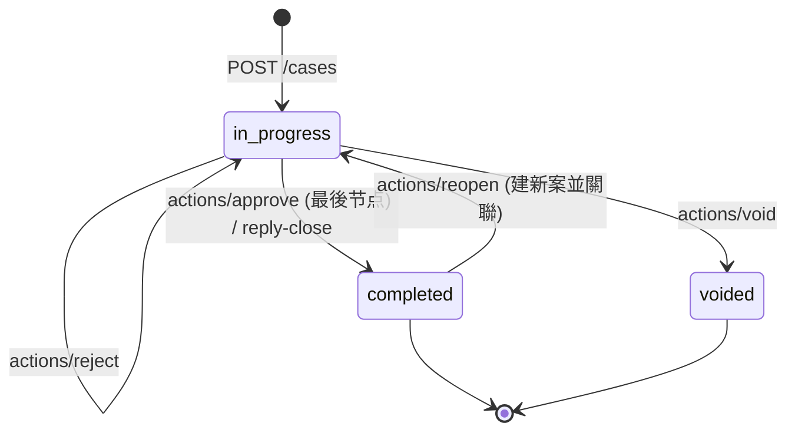
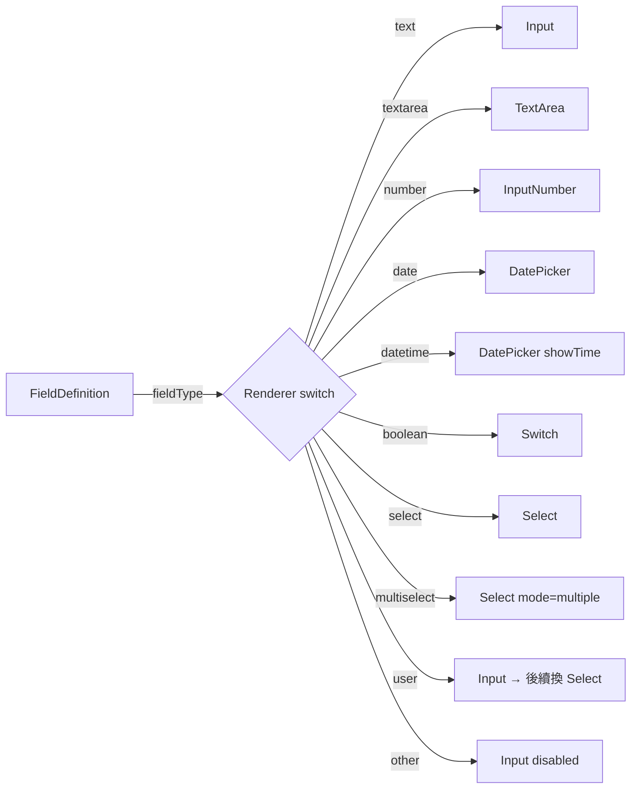

# 案件前端設計 (issue #21 [5.5])

## 1. 目標

為「工作需求單」提供完整的全生命週期前端介面：發起、處理、簽核、作廢、重開、與衍生子流程。與 issue #11 的動態欄位、#13 的流程範本設計器、#8 的 RBAC 連動。

## 2. 檔案組織

```
web/src/api/
  cases.ts                    # API client + 型別
  mockCases.ts                # dev mock interceptor (in-memory state machine)
web/src/components/
  DynamicFieldRenderer.tsx    # 依 9 種 fieldType 切換 antd input/readonly view
web/src/pages/cases/
  CaseListPage.tsx            # 案件清單頁
CaseCreatePage.tsx          # 發起表單
CaseDetailPage.tsx          # 詳情頁（節點、欄位、軌跡、關聯 Tab）
CaseActionButtons.tsx       # 動作按鈕區（含 6 個內嵌 modal）
```

## 3. API 契約

對齊後端 issue 作為唯一來源。

| 端點 | 對應 issue | 說明 |
| --- | --- | --- |
| `GET    /api/cases` | #9 + #29 | 案件清單（笩選 status/mineOnly/template/customer）|
| `GET    /api/cases/:id` | 多 issue | 案件詳細（含 fields/nodes/actions/relations）|
| `POST   /api/cases` | #9 [5.2.1] | 發起案件（自動取號 #16）|
| `PUT    /api/cases/:id/assign` | #9 | 指派承辦人 |
| `POST   /api/cases/:id/actions/accept` | #15 | 接單 |
| `POST   /api/cases/:id/actions/reply-close` | #15 | 回覆結案（路徑 A）|
| `POST   /api/cases/:id/actions/approve` | #15 | 核准 / 結案 |
| `POST   /api/cases/:id/actions/reject` | #15 | 退回至前一處理節點 |
| `POST   /api/cases/:id/actions/void` | #18 [5.3.3] | 作廢（主案作廢連鎖子流程）|
| `POST   /api/cases/:id/actions/spawn-child` | #17 [5.3.1] | 衍生子流程（雙向關聯）|
| `POST   /api/cases/:id/actions/reopen` | #32 [5.3.4] | 結案後重開新案 |
| `PUT    /api/cases/:id/expected-completion` | #20 [5.4.1] | 修改預計完成時間 |

## 4. 案件狀態機



## 5. 按鈕顯示規則矩陣

| 按鈕 | 條件 |
| --- | --- |
| 接單 | `status=in_progress` AND 當前節點 `nodeType=handle` AND 我是 assignee |
| 回覆結案 | 同上 |
| 核准 | `status=in_progress` AND 當前節點 `nodeType=approve` AND 我是 assignee |
| 退回 | `status=in_progress` AND 我是 assignee |
| 指派 | `status=in_progress` AND 有 `cases.manage` 權限 |
| 修改預計完成時間 | `status=in_progress` AND (我是 assignee 或發起人或管理者) |
| 衍生子流程 | `status=in_progress` AND 有 `cases.spawn_child` |
| 作廢 | `status=in_progress` AND 有 `cases.void` |
| 重開新案 | `status=completed` AND 有 `cases.reopen` |

這些额外受「當前節點 assignee 是誰」限制 — 根本上是「牌面牌牌造」的複合 RBAC，遷就使用者體驗。

## 6. 動態欄位與 #11 的連動

`DynamicFieldRenderer` 設計為「只讀 + 可寫」雙模式。本輪依搎 #11 [3.1.2] 的 9 種 fieldType，後續可補上「表格型欄位 (multi-row)」、「檔案上傳欄位 (依 #26)」等進階類型。



## 7. Mock 狀態機

`mockCases.ts` 實作完整的 in-memory state machine，讓前端不依賴後端即可走所有 flow：

- 5 個預建範例案件覆蓋進行中 / 已結案 / 已作廢 / 子流程 / 重開場景
- `POST /cases` 自動取號 (`ITCT-{type}-{yy}{seq:04}`) 模擬 #16 [5.1.1]
- `actions/spawn-child` 自動雙向設定 `CaseRelation`、`actions/void` 連鎖作廢未完成子流程
- `actions/approve` 進一個節點（若是最後一個 end 節點則整案結案）
- `actions/reject` 回到前一個 handle 節點
- `actions/reopen` 建新案並設定 `relationType=reopen` 雙向關聯

切換到真實後端：`web/.env.development` 設 `VITE_USE_MOCK_CASES=false`。

## 8. 驗收條件對照

| 驗收條件 | 實作位置 |
| --- | --- |
| 案件發起表單（動態欄位） | `CaseCreatePage.tsx` + `DynamicFieldRenderer.tsx` |
| 案件詳情頁（節點進度、欄位、動作按鈕） | `CaseDetailPage.tsx` + Steps + Tabs + `CaseActionButtons.tsx` |
| 接單/指派/核准/退回/作廢 | `CaseActionButtons.tsx` |
| 預計完成時間設定與修改 | `CaseCreatePage` (首設) + `UpdateExpectedModal` |
| 權限控管按鈕顯示 | `useHasPermission` + 案件內部狀態檢查 |
| 衍生子流程與關聯顯示 | `SpawnChildModal` + `CaseDetailPage` Relations Tab |

## 9. 後續可擴充

- 子流程「可繼承欄位」指定 UI（issue #19 [5.3.2]）
- 清單頁的全文搜尋與多條件笩選 (issue #27 [8.1])
- PDF 匯出按鈕 (issue #28 [8.2])
- 案件留言區 (issue #25 [7.1])
- 附件上傳 (issue #26 [7.2])
- 首頁待辦仮表使用 `casesApi.list({ mineOnly: true })` (issue #29 [8.3])
