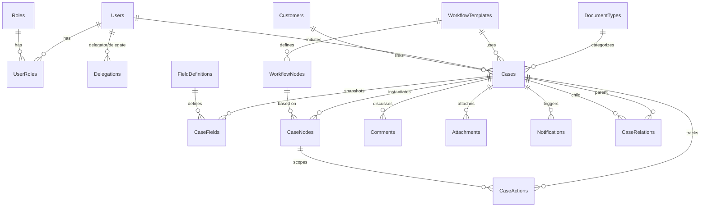

# IsoDocs 資料庫結構設計

> 對應 issue #5：[1.3] 設計並建立核心資料庫結構（SQL Server 2022 / Azure SQL Database）

## 1. 設計原則

- **Code First + EF Core 8**：所有資料表結構由 `IsoDocs.Domain` 的實體類別 + `IsoDocs.Infrastructure/Persistence/Configurations` 產生 Migration。
- **Temporal Tables**：對需要追溯版本的核心實體啟用 SQL Server 2022 Temporal Tables，由 EF Core 在 Migration 中自動產生 `*_History` 影子表。
- **版本快照（Snapshot）**：流程範本與欄位定義異動時新增版本（`Version` 欄位累加），進行中的案件以建立當下的 `TemplateVersion` / `FieldVersion` 凍結，避免異動影響既有紀錄。
- **不刪除**：使用者、角色、客戶、附件、留言皆採軟刪除（`IsActive=false` 或 `IsDeleted=true`），不做 hard delete，以利稽核。
- **Action 軌跡**：所有對案件的動作都寫入 `CaseActions` 一張表，並以 `ActionType` 列舉區分，便於跨類型查詢。

## 2. 模組與資料表清單

| 模組 | 資料表 | 啟用 Temporal | 主要用途 |
| --- | --- | --- | --- |
| Identity | `Users` | ✅ | Azure AD 同步來的使用者主檔 |
| Identity | `Roles` | ✅ | 自訂角色，權限存於 `PermissionsJson` |
| Identity | `UserRoles` | ❌ | 使用者—角色多對多，含 `EffectiveFrom/EffectiveTo` |
| Identity | `Delegations` | ❌ | 代理機制（issue [2.3.2]） |
| Workflows | `WorkflowTemplates` | ✅ | 流程範本，支援 `Version` 與 `PublishedAt` |
| Workflows | `WorkflowNodes` | ❌ | 範本下的節點定義（依 `TemplateVersion` 凍結） |
| Workflows | `FieldDefinitions` | ✅ | 自訂欄位定義（issue [3.1.1]） |
| Workflows | `DocumentTypes` | ✅ | 文件類型 + 取號流水號（含 `RowVersion` 樂觀鎖） |
| Customers | `Customers` | ❌ | 客戶主檔（issue [4.1]） |
| Cases | `Cases` | ✅ | 案件主檔（含 `OriginalExpectedAt`、`CustomVersionNumber`） |
| Cases | `CaseFields` | ✅ | 案件欄位值快照 |
| Cases | `CaseRelations` | ❌ | 主子流程／重開新案的雙向關聯 |
| Cases | `CaseNodes` | ✅ | 案件節點實例（含 `ModifiedExpectedAt`） |
| Cases | `CaseActions` | ❌ | 案件動作軌跡（append-only） |
| Communications | `Comments` | ❌ | 案件留言（軟刪除） |
| Communications | `Notifications` | ❌ | 通知紀錄(含 `RetryCount`、`LastError`） |
| Attachments | `Attachments` | ❌ | 附件 metadata（檔案本體於 Azure Blob） |
| Audit | `AuditTrails` | ❌ | 系統層稽核軌跡（與 `CaseActions` 區分） |

## 3. 主要關聯（ER 概念圖）



## 4. 索引策略

| 表 | 索引 | 用途 |
| --- | --- | --- |
| `Users` | `AzureAdObjectId` UQ、`Email` UQ、`IsActive` | 登入與啟用狀態查詢 |
| `Roles` | `Name` UQ | 防止重複角色 |
| `UserRoles` | `(UserId, RoleId)`、`(UserId, EffectiveFrom, EffectiveTo)` | 角色查詢、有效期間判斷 |
| `WorkflowTemplates` | `(Code, Version)` UQ、`IsActive` | 範本版本查詢 |
| `WorkflowNodes` | `(WorkflowTemplateId, TemplateVersion, NodeOrder)` UQ | 節點順序唯一 |
| `FieldDefinitions` | `(Code, Version)` UQ、`IsActive` | 欄位版本查詢 |
| `DocumentTypes` | `(CompanyCode, Code)` UQ | 文件類型唯一 |
| `Customers` | `Code` UQ、`Name`、`IsActive` | 客戶查詢 |
| `Cases` | `CaseNumber` UQ、`(Status, InitiatedAt)`、`InitiatedByUserId`、`CustomerId`、`DocumentTypeId` | 案件清單、首頁待辦 |
| `CaseFields` | `(CaseId, FieldCode)` UQ | 同案件相同欄位唯一 |
| `CaseRelations` | `(ParentCaseId, ChildCaseId, RelationType)` UQ、`ChildCaseId` | 反向查詢主案 |
| `CaseNodes` | `(CaseId, NodeOrder)`、`(AssigneeUserId, Status)`、`Status` | 我的待辦、流轉狀態 |
| `CaseActions` | `(CaseId, ActionAt)`、`ActorUserId`、`ActionType` | 案件軌跡、稽核 |
| `Comments` | `(CaseId, CreatedAt)`、`IsDeleted` | 留言清單 |
| `Notifications` | `(RecipientUserId, IsRead)`、`SentAt` | 未讀通知中心 |
| `Attachments` | `CaseId`、`IsDeleted` | 附件清單 |
| `AuditTrails` | `(EntityType, EntityId)`、`OccurredAt` | 稽核查詢 |

## 5. Temporal Tables 細節

EF Core 8 啟用 Temporal Tables 的設定方式：

```csharp
builder.ToTable("Cases", t => t.IsTemporal());
```

啟用後 SQL Server 會：

1. 自動加上兩個隱藏欄位 `PeriodStart` / `PeriodEnd`（`datetime2`）。
2. 建立同名的 `_History` 表，所有更新/刪除自動寫入歷史。
3. 可用 `FOR SYSTEM_TIME AS OF` 或 EF Core 的 `TemporalAsOf` 等延伸查詢任一時點的狀態。

> 啟用 Temporal 的實體：`Users`、`Roles`、`WorkflowTemplates`、`FieldDefinitions`、`DocumentTypes`、`Cases`、`CaseFields`、`CaseNodes`。
> 不啟用 Temporal 的實體（已有自己的軌跡或 append-only）：`UserRoles`、`Delegations`、`WorkflowNodes`、`Customers`、`CaseActions`、`CaseRelations`、`Comments`、`Notifications`、`Attachments`、`AuditTrails`。

> ✅ **Cascade 多重路徑（已修補）**：`Cases → CaseNodes (Cascade)` 與 `Cases → CaseActions (Cascade)` 同時存在會撞 SQL Server 1785（multiple cascade paths）。`CaseActionConfiguration.cs` 已將 `CaseNodeId` 設為 `OnDelete(NoAction)`（不再是 `SetNull`），與 `docs/sql/initial_schema.sql` 對齊。詳見 §10.3。

## 6. 取號邏輯（DocumentType.AcquireNext）

格式：`{CompanyCode}-{Code}-{YearTwoDigits}{Sequence:D4}`，例如 `ITCT-F01-260076`。

- 流水號依文件類型各自累計於 `DocumentTypes.CurrentSequence`。
- 每年自動重置：`SequenceYear` 不等於當前年度時將 `CurrentSequence` 歸零。
- 併發控制：`DocumentTypes.RowVersion`（`rowversion`）作為樂觀鎖；同時建議於 Application 層配合 `IDbContextFactory` 的短交易執行 `AcquireNext + SaveChanges` 以避免鎖等待。
- 後續若需更高併發，可改用 SQL Server 的 `SEQUENCE` 物件並由 stored procedure 提供原子取號（issue [5.1.1] 壓力測試後評估）。

## 7. Migration 操作

> 建表有兩條路徑：**(A) EF Core Migration（正式）** 與 **(B) `docs/sql/initial_schema.sql`（fallback）**。
> 正式環境一律走 (A)，由 EF Core 維護版本一致性。(B) 提供給沒有 dotnet SDK 的審查／救援場景，詳見 §10。

### 7.1 第一次安裝 EF Core 工具

```bash
dotnet tool install --global dotnet-ef --version 8.0.10
```

### 7.2 從 repo 根目錄執行（路徑 A）

```bash
# 產生 Migration 程式碼到 IsoDocs.Infrastructure/Migrations
dotnet ef migrations add InitialSchema \
  --project src/IsoDocs.Infrastructure \
  --startup-project src/IsoDocs.Api \
  --output-dir Persistence/Migrations

# 套用到目前 ConnectionStrings:DefaultConnection 指向的資料庫
dotnet ef database update \
  --project src/IsoDocs.Infrastructure \
  --startup-project src/IsoDocs.Api
```

### 7.3 連線字串提供方式（請勿提交至 repo）

開發機建議以 user-secrets：

```bash
cd src/IsoDocs.Api
dotnet user-secrets set "ConnectionStrings:DefaultConnection" \
  "Server=localhost;Database=IsoDocs;Trusted_Connection=True;TrustServerCertificate=True"
```

CI/CD 或部署環境建議用環境變數：`ConnectionStrings__DefaultConnection`。

### 7.4 後續異動流程

1. 修改實體或 Configuration。
2. `dotnet ef migrations add <ChangeName>`。
3. Code review Migration 內容（特別是 Temporal Tables 變更，需注意歷史表相容性）。
4. 部署時透過 CI/CD 跑 `dotnet ef database update` 或於部署 pipeline 整合 `Database.Migrate()`。

## 8. 與既有 issue 的對應

| issue | 對應實體／設計 |
| --- | --- |
| [2.1.1] / [2.1.2] | `Users`（透過 `AzureAdObjectId` 同步） |
| [2.2.1] / [2.2.2] | `Roles`、`UserRoles`、`PermissionsJson` |
| [2.3.1] | `Users`（`IsActive`、`InvitedBy` 後續視需要再擴充） |
| [2.3.2] | `Delegations` |
| [3.1.1] / [3.1.2] | `FieldDefinitions`（`Version`） + `CaseFields`（`FieldVersion`） |
| [3.2.1] / [3.2.2] | `WorkflowTemplates`（`Version`、`PublishedAt`） + `WorkflowNodes` |
| [4.1] | `Customers` |
| [5.1.1] | `DocumentTypes.AcquireNext` |
| [5.1.2] | `Cases.Status` + `CaseNodes.Status`（後續導入 Elsa/Stateless） |
| [5.2.1] / [5.2.2] | `CaseActions`（`Initiate`/`Assign`/`Accept`/`ReplyClose`/`Approve`/`Reject`） |
| [5.3.1] | `CaseRelations`（`Subprocess`） |
| [5.3.2] | `WorkflowNodes.ConfigJson`（含可繼承欄位設定） |
| [5.3.3] | `Cases.VoidedAt` + `CaseActions.Void`/`VoidCascade` |
| [5.3.4] | `CaseRelations`（`Reopen`） |
| [5.4.1] | `Cases.OriginalExpectedAt` + `CaseNodes.ModifiedExpectedAt` |
| [5.4.2] | `Cases.CustomVersionNumber` |
| [5.4.3] | `CaseActions.SignOff`（含 `Comment`、`ActionAt`） |
| [6.x] | `Notifications`（`Channel`、`Type`、`RetryCount`） |
| [7.1] | `Comments` |
| [7.2] | `Attachments`（`BlobUrl`、`IsDeleted` 軟刪除） |
| [8.1] | 各表索引（`(Status, InitiatedAt)`、`(AssigneeUserId, Status)` 等） |
| [8.x] | `Cases`、`CaseNodes` 提供首頁查詢需要的欄位 |

## 9. 後續工作

- [ ] 於本機執行 `dotnet ef migrations add InitialSchema` 產生 Migration C# 檔並提交（cascade 修補已於 commit `eec4a00` 套用，此步只需跑 EF CLI）。
- [ ] 執行 `dotnet ef migrations script -o initial_ef_generated.sql` 與 `docs/sql/initial_schema.sql` 做 diff，確認語意對齊。
- [ ] 撰寫 Repository / UnitOfWork 抽象（將於 issue #9 [5.2.1] 一併處理）。
- [ ] 補上 Domain 內的補充實體：`Notification.PayloadJson` 結構文件、`Permissions` JSON schema。
- [ ] 撰寫整合測試所需的 `WebApplicationFactory` 設定（搭配 Testcontainers SQL Server）。
- [ ] 評估是否要把 `CaseActions` 改為 SQL Server `EVENTSTREAM` 或仍維持單表（壓力測試後再決定）。

## 10. SQL DDL Fallback（`docs/sql/initial_schema.sql`）

提供一份不依賴 dotnet SDK 也能執行的「語意對等」原始 DDL 腳本，位於 `docs/sql/initial_schema.sql`。它依 `IsoDocs.Infrastructure/Persistence/Configurations/*.cs` 反推產生，含：

1. **18 張資料表**：欄位、型別、長度、nullability 全對齊 Configuration。
2. **8 張 Temporal History 表**：採 EF Core 8 預設命名 `{TableName}History`，period 欄位為 `PeriodStart` / `PeriodEnd`（HIDDEN）。
3. **Foreign Keys**：以 `ALTER TABLE` 集中宣告，便於審查 cascade 行為。
4. **Indexes**：含所有 `HasIndex(...).IsUnique()` 與一般索引。

### 10.1 適用場景

- DBA / 資安／架構師審查 schema，無需安裝 dotnet SDK。
- 緊急 / 沙箱環境想快速重建空資料庫。
- 與 `dotnet ef migrations script` 產出做交叉比對，捕捉 EF Configuration 與實體標註不一致的細節。

### 10.2 不適用場景（非常重要）

- **正式環境的 schema 演進**：請仍以 EF Core Migration（C# 檔）為唯一真相。本 SQL 腳本不在 EF 的版本控制裡，跑完不會有 `__EFMigrationsHistory` 紀錄，後續 `database update` 會以為資料庫是空的而再嘗試建表。

### 10.3 CaseAction.CaseNodeId（已 reconciled）

歷史脈絡：早期 `CaseActionConfiguration.cs` 將 `CaseNodeId` 設為 `OnDelete(DeleteBehavior.SetNull)`，但 SQL Server 不允許「同一個 root 透過兩條路徑都對 `CaseActions` 執行 cascading action」（`Cases → CaseActions (Cascade)` 與 `Cases → CaseNodes → CaseActions (SetNull)`）—— 會在建立 FK 時回 1785（multiple cascade paths）。

修補：commit `eec4a00`（issue #5）已將 EF Configuration 改為 `OnDelete(DeleteBehavior.NoAction)`，與 `docs/sql/initial_schema.sql` 中 `FK_CaseActions_CaseNodes_CaseNodeId ... ON DELETE NO ACTION` 對齊。實務上案件不會被 hard-delete（透過 `Status = Voided` 軟廢），此 FK 的 cascade 行為其實不會被觸發，所以 `NoAction` 不會造成資料風險。

```diff
 // CaseActionConfiguration.cs（修補後）
 builder.HasOne<CaseNode>()
     .WithMany()
     .HasForeignKey(x => x.CaseNodeId)
-    .OnDelete(DeleteBehavior.SetNull);
+    .OnDelete(DeleteBehavior.NoAction);
```
