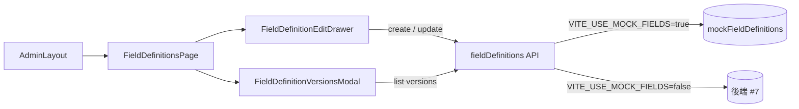
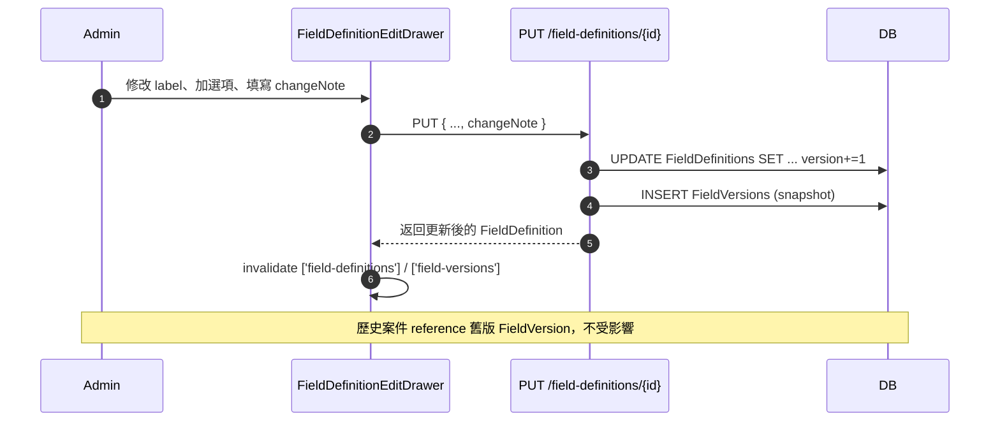

# 自訂欄位管理前端 UI（issue #11 [3.1.2]）

對應 issue：[#11 [3.1.2] 建立自訂欄位管理前端介面](https://github.com/stanleyjbjob/IsoDocs/issues/11)
後端對位：[#7 [3.1.1] 實作自訂欄位定義與版本隴離機制](https://github.com/stanleyjbjob/IsoDocs/issues/7)

## 1. 架構概觀

本功能讓管理者在「/admin/fields」頁面建立、修改、停用「案件自訂欄位」。修改會自動建立新版本快照，進行中與歷史案件不受影響。



## 2. 檔案清單

| 檔案 | 職責 |
| --- | --- |
| `web/src/lib/fieldTypes.ts` | 9 種欄位類型 catalog（`text`/`textarea`/`number`/`date`/`datetime`/`boolean`/`select`/`multiselect`/`user`）、每種類型的 `configKeys` 說明 |
| `web/src/api/fieldDefinitions.ts` | API client 與 TS 型別 |
| `web/src/api/mockFieldDefinitions.ts` | dev 假資料 + axios interceptor |
| `web/src/pages/admin/FieldDefinitionsPage.tsx` | 清單頁 |
| `web/src/pages/admin/FieldDefinitionEditDrawer.tsx` | 建立 / 編輯 drawer |
| `web/src/pages/admin/FieldDefinitionVersionsModal.tsx` | 版本歷史 |

## 3. API 契約（對齊 #7）

| Method | Path | 說明 |
| --- | --- | --- |
| GET | `/api/field-definitions` | 列出所有欄位。預設不含停用，加 `?includeInactive=true` 含全部 |
| POST | `/api/field-definitions` | 建立欄位，自動 version=1 |
| PUT | `/api/field-definitions/{id}` | 更新欄位→**後端自動建立新 FieldVersion 快照**，version+=1 |
| GET | `/api/field-definitions/{id}/versions` | 取得該欄位的版本歷史（最新在前） |

### 3.1 不允許修改的欄位

`code` 與 `fieldType` 一旦建立不可改，避免破壞歷史資料相容性（`CaseField` 快照根據 `code` 與 `fieldType` 解析）。需要變類型請「建立新欄位 + 停用舊欄位」。

### 3.2 類型特定 config

| FieldType | 可用 config keys | 訪計求 |
| --- | --- | --- |
| `text` | `maxLength` | 單行短文字 |
| `textarea` | `rows`, `maxLength` | 多行文字 |
| `number` | `min`, `max`, `precision` | 整數或小數 |
| `date` / `datetime` | `format` | 預設 ISO8601 |
| `boolean` | 無 | 是／否 |
| `select` / `multiselect` | `options[]`, `allowCustom` | 下拉選項 |
| `user` | `restrictedToRoleIds[]` | 使用者選擇器 |

## 4. 版本隴離機制



這個設計讓「進行中案件」仍然能看到當初建立時的欄位設定，敢改變需要重新進行「案件資料遛迴」（這是 #7 的職責，前端不處理）。

## 5. RBAC 控管

- 路由 `/admin/fields` 被 `RequireAuth` + `AdminLayout`（`useIsAdmin` gate）雙重保護
- 「建立 / 編輯 / 停用 / 啟用」按鈕受 `useHasPermission('fields.manage')` 控管
- 「版本歷史」按鈕不限制權限（只讀）。若需限制為 `fields.view` 並不難，但實務上能進 admin 區的人差不多全是可看

## 6. Mock 切換

```bash
# dev 預設：web/.env.development
VITE_USE_MOCK_RBAC=true     # issue #8
VITE_USE_MOCK_FIELDS=true   # 本 issue

# #7 落地後
VITE_USE_MOCK_FIELDS=false
```

Mock interceptor 只攔截 `/field-definitions*` 端點，其他請求一律放行。並與 #8 的 `/roles*` mock 互不影響。

## 7. 與 #7 銘接

#7 落地後，前端主要要驗證：

1. `FieldDefinition` 型別與後端回傳結構一致（特別是 `config` JSON）
2. `PUT` 後後端是否返回 包含新 version 的 FieldDefinition
3. `GET /versions` 是否並並並並並並並並並並並取 changeNote

## 8. 驗收條件對照

| 驗收條件 | 實作 |
| --- | --- |
| 欄位清單頁面 | `FieldDefinitionsPage.tsx` |
| 欄位新增／編輯表單 | `FieldDefinitionEditDrawer.tsx` |
| 支援多種欄位類型選擇 | `FIELD_TYPES` × 9 + drawer 內 type select |
| 顯示欄位版本歷史 | `FieldDefinitionVersionsModal.tsx` |
| 異動時顯示警告說明 | drawer edit mode 的 `<Alert>` |

## 9. 本輪未完成

- 未經 CI 第一次 run 驗證（sandbox 不能跑 typecheck/build）。Web CI workflow（issue #34 commit `50e1d48`）推上對應 PR 時會自動跑
- 端到端驗證需 #7 落地後才能跑真實 API
- 本分支 base 為 `feature/issue-8-roles-admin-ui`，合併時 #34 → #8 → 本件順序依序合併
