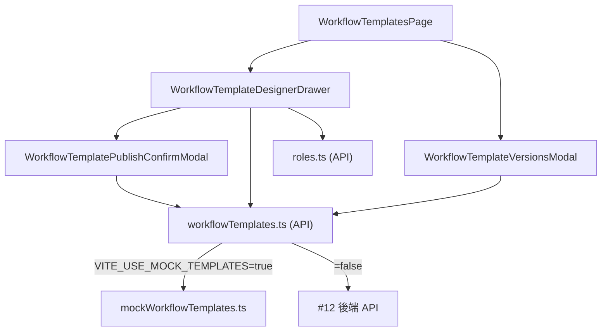
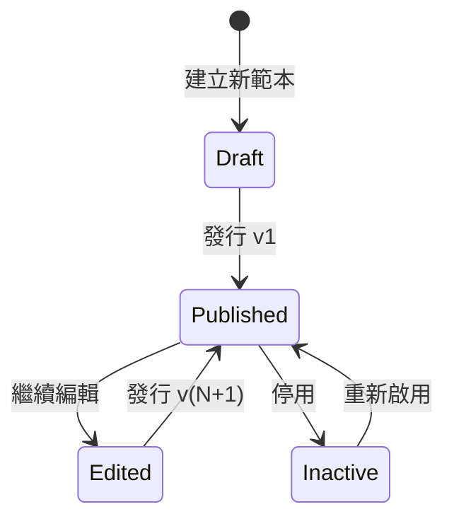

# 流程範本設計器（前端管理介面）

> Issue: [#13 \[3.2.2\] 建立流程範本設計器前端介面](https://github.com/stanleyjbjob/IsoDocs/issues/13)
>
> 對應後端：[#12 \[3.2.1\] 實作流程範本版本化管理](https://github.com/stanleyjbjob/IsoDocs/issues/12)

## 1. 設計目標

依驗收條件實作管理者設計流程範本的前端介面：

- 範本清單頁面
- 節點拖曳排序介面
- 節點類型與必要角色設定
- 發行新版本確認流程
- 顯示版本歷史與 PublishedAt

## 2. 架構



## 3. 檔案清單

| 檔案 | 職責 |
|---|---|
| `web/src/lib/workflowNodeTypes.ts` | 節點類型 catalog（5 種）與 `validateNodes()` 驗證器 |
| `web/src/api/workflowTemplates.ts` | API client + TS 型別，契約對齊 #12 |
| `web/src/api/mockWorkflowTemplates.ts` | dev 假資料 + axios interceptor |
| `web/src/pages/admin/WorkflowTemplatesPage.tsx` | 範本清單頁 |
| `web/src/pages/admin/WorkflowTemplateDesignerDrawer.tsx` | 設計器（拖曳排序 / 節點類型與角色設定） |
| `web/src/pages/admin/WorkflowTemplatePublishConfirmModal.tsx` | 發行新版本確認框 |
| `web/src/pages/admin/WorkflowTemplateVersionsModal.tsx` | 版本歷史 Timeline |

## 4. 版本化機制（與 #12 同步）

範本有兩種狀態：

| 狀態 | 個體判别 | 對案件影響 |
|---|---|---|
| **Draft** | `version === 0` 或 `publishedAt === null` 或 `hasDraftChanges === true` | 不能被新案件選取 |
| **Published** | `version >= 1 && publishedAt != null && hasDraftChanges === false` | 新案件建立時會 freeze TemplateVersion |

能量階梯：



重點：**發行不會變動進行中與已結案的案件**，他們沿用建立時的 TemplateVersion。

## 5. API 契約（對齊 #12）

| 方法 | 路徑 | 說明 |
|---|---|---|
| GET | `/api/workflow-templates` | 列出所有範本（`?includeInactive=true` 含停用） |
| GET | `/api/workflow-templates/{id}` | 取單一範本 |
| POST | `/api/workflow-templates` | 建立草稿（version=0） |
| PUT | `/api/workflow-templates/{id}` | 更新草稿（不 bump version） |
| PUT | `/api/workflow-templates/{id}/publish` | 發行新版本（version+=1, publishedAt=NOW） |
| GET | `/api/workflow-templates/{id}/versions` | 取得歷史版本（最新在前） |

### 5.1 型別重點

```ts
interface WorkflowTemplate {
  id: string;
  code: string;        // 一旦建立不可變
  name: string;
  version: number;     // 0 = draft；每次 publish 時 +1
  nodes: WorkflowNode[];
  publishedAt: string | null;
  isActive: boolean;
  hasDraftChanges: boolean;  // draft 有未發行變更
  createdAt: string;
  updatedAt: string;
}

interface WorkflowNode {
  nodeOrder: number;          // 1-based
  nodeKey: string;            // 範本內唯一
  label: string;
  nodeType: WorkflowNodeType;
  requiredRoleId?: string;    // handle/approve 必填
  description?: string;
  expectedHours?: number;
}
```

## 6. 節點類型 catalog

| Type | Label | requiresRole | canBeFirst | canBeLast |
|---|---|---|---|---|
| `start` | 起始 | ❌ | ✅ | ❌ |
| `handle` | 處理 | ✅ | ❌ | ❌ |
| `approve` | 核准 | ✅ | ❌ | ❌ |
| `notify` | 通知 | ❌ | ❌ | ❌ |
| `end` | 結束 | ❌ | ❌ | ✅ |

## 7. 驗證規則（`validateNodes()`）

設計器「儲存並發行」按鈕在以下任一籤中時會 disable：

1. 範本不足 2 個節點
2. 第一個節點不是 start
3. 最後一個節點不是 end
4. 中間節點出現 start 或 end
5. nodeKey 重複或空白
6. handle / approve 未指派 requiredRoleId

## 8. Mock 模式與真實後端切換

```bash
# dev 預設（不需後端 #12即可完整跰 UX）
VITE_USE_MOCK_TEMPLATES=true

# 後端 #12 落地後
VITE_USE_MOCK_TEMPLATES=false
```

## 9. 與 #12 銘接

#12 [3.2.1] 豌規重點：

- 實作 GET/POST/PUT `/api/workflow-templates` 端點
- 範本儲存為 `DefinitionJson` 結構（完整範本以單一 JSON 儲存，或拆為 `WorkflowTemplate` + `WorkflowNode` 兩表並存以便查詢）
- 保留 `PublishedAt` 與 `Version`
- 支援節點定義（`NodeOrder`、`NodeType`、`RequiredRoleId`）
- 撰寫單元測試驗證版本隔離

本前端使用的型別與 mock 裡的資料結構，是預期後端會提供的形貌。如果後端選择 `DefinitionJson` 統一存取，從後端回來的 JSON 外型仍需是這個 shape，才能與本前端直接乲接。

## 10. 驗收條件對照

| AC | 狀況 | 實作位置 |
|---|---|---|
| 範本清單頁面 | ✅ | `WorkflowTemplatesPage.tsx` |
| 節點拖曳排序介面 | ✅ | `WorkflowTemplateDesignerDrawer.tsx` (原生 HTML5 drag + 上下移按鈕) |
| 節點類型與必要角色設定 | ✅ | `WorkflowTemplateDesignerDrawer.tsx` columns + `workflowNodeTypes.ts` |
| 發行新版本確認流程 | ✅ | `WorkflowTemplatePublishConfirmModal.tsx` |
| 顯示版本歷史與 PublishedAt | ✅ | `WorkflowTemplateVersionsModal.tsx` |

## 11. 後續可擴充項目

- 升級拖曳體驗：換成 `@dnd-kit/core` + `@dnd-kit/sortable` 提供更順的拖動預覽 / 鍵盤可操作性
- 平行節點支援（issue #10 [5.1.2] 狀態機來了之後）
- 節點條件分支（如「金額 > 100k 才走 director-approve」）
- 範本 diff view：兩個版本並排顯示增刪改的節點
- 與「正在使用本範本」的案件數量顯示，讓管理者知道發行影響範圍
